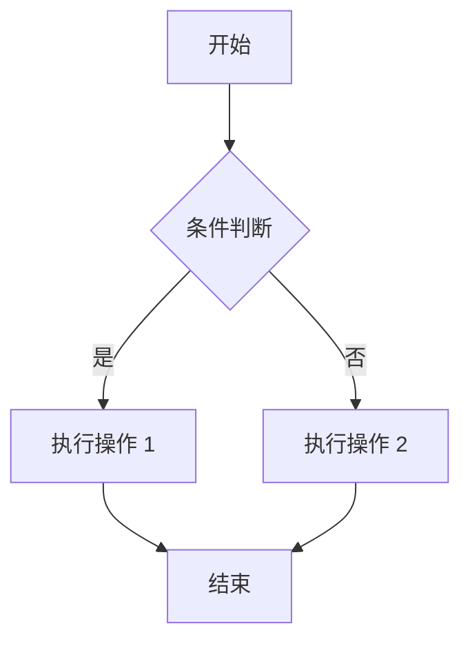
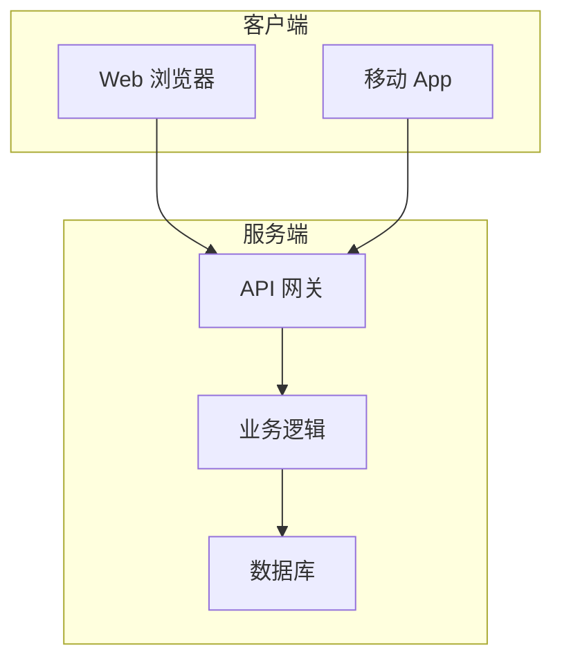

# 章节模板（Chapter Template）

> 用于撰写书籍章节的标准模板

---

## 章节信息

- **章节编号**：第 X 章
- **章节标题**：[章节标题]
- **所属部分**：[部分名称]
- **作者**：[作者姓名]
- **版本**：[版本号]
- **最后更新**：[日期]

---

## 学习目标

读完本章后，你将能够：
- [ ] [学习目标 1]
- [ ] [学习目标 2]
- [ ] [学习目标 3]
- [ ] [学习目标 4]
- [ ] [学习目标 5]

---

## 章节引言

### 问题引入
[用一个实际问题或场景引入本章主题，例如：]

> 在实际开发中，我们经常遇到 XXX 问题。传统的解决方案是 XXX，但这种方式存在 XXX 的缺点。本章将介绍一种更优雅的解决方案——XXX。

### 本章概览
[简要介绍本章的主要内容和结构，例如：]

本章将从以下几个方面展开：
1. 首先，我们将了解 XXX 的基本概念
2. 然后，深入学习 XXX 的核心原理
3. 接着，通过实际案例演示 XXX 的应用
4. 最后，总结 XXX 的最佳实践和常见陷阱

---

## X.1 [节标题]

### X.1.1 [小节标题]

[正文内容]

**关键概念**：
- 概念 1：[解释]
- 概念 2：[解释]
- 概念 3：[解释]

**示例代码**：
```python
# 代码示例
def example_function():
    """示例函数"""
    pass
```

> **提示**：[重要提示或技巧]

### X.1.2 [小节标题]

[正文内容]

**表格示例**：

| 特性 | 说明 | 示例 |
|------|------|------|
| 特性 1 | 说明 1 | 示例 1 |
| 特性 2 | 说明 2 | 示例 2 |
| 特性 3 | 说明 3 | 示例 3 |

---

## X.2 [节标题]

### X.2.1 [小节标题]

[正文内容]

**代码示例 X-1**：[代码标题]
```python
# 完整的代码示例
class Example:
    def __init__(self):
        self.value = 0
    
    def process(self):
        """处理逻辑"""
        return self.value * 2
```

**代码说明**：
1. 第 1-3 行：[说明]
2. 第 5-7 行：[说明]
3. 第 9-11 行：[说明]

**运行结果**：
```
$ python example.py
输出结果：XXX
```

### X.2.2 [小节标题]

[正文内容]

**注意**：
> ⚠️ **常见错误**：[描述常见错误和避免方法]

---

## X.3 [节标题]

### X.3.1 [小节标题]

[正文内容]

**流程图**：


### X.3.2 [小节标题]

[正文内容]

**架构图**：


---

## X.4 实战案例

### 案例 X-1：[案例标题]

**背景**：
[描述案例背景和需求]

**需求分析**：
1. 需求 1：[描述]
2. 需求 2：[描述]
3. 需求 3：[描述]

**设计方案**：
[描述设计方案和实现思路]

**代码实现**：
```python
# 完整的实战代码
class Project:
    def __init__(self):
        pass
    
    def implement(self):
        """实现逻辑"""
        pass
```

**测试验证**：
```bash
$ pytest test_project.py
============================= test session starts ==============================
collected 5 items

test_project.py .....                                                    [100%]
============================== 5 passed in 0.12s ===============================
```

**经验总结**：
- 要点 1：[总结]
- 要点 2：[总结]
- 要点 3：[总结]

---

## X.5 常见问题（FAQ）

### Q1：[问题 1]
**A**：[回答]

### Q2：[问题 2]
**A**：[回答]

### Q3：[问题 3]
**A**：[回答]

---

## X.6 最佳实践

### 实践 1：[实践标题]
**场景**：[适用场景]  
**建议**：[具体建议]  
**示例**：
```python
# 好的做法
def good_example():
    pass

# 不好的做法
def bad_example():
    pass
```

### 实践 2：[实践标题]
**场景**：[适用场景]  
**建议**：[具体建议]  
**示例**：
```python
# 代码示例
pass
```

### 实践 3：[实践标题]
**场景**：[适用场景]  
**建议**：[具体建议]  
**示例**：
```python
# 代码示例
pass
```

---

## X.7 常见陷阱

### 陷阱 1：[陷阱标题]
**问题描述**：[描述问题]  
**错误示例**：
```python
# 错误的做法
def wrong_way():
    pass
```

**正确做法**：
```python
# 正确的做法
def right_way():
    pass
```

**原因分析**：[分析原因]

### 陷阱 2：[陷阱标题]
**问题描述**：[描述问题]  
**错误示例**：
```python
# 错误的做法
pass
```

**正确做法**：
```python
# 正确的做法
pass
```

**原因分析**：[分析原因]

---

## X.8 本章小结

### 要点回顾
在本章中，我们学习了：
1. [要点 1]
2. [要点 2]
3. [要点 3]
4. [要点 4]
5. [要点 5]

### 关键概念
- **概念 1**：[简要解释]
- **概念 2**：[简要解释]
- **概念 3**：[简要解释]

### 核心技能
- 技能 1：[描述]
- 技能 2：[描述]
- 技能 3：[描述]

---

## X.9 练习题

### 选择题（每题 2 分，共 20 分）

**题目 1**：[题目内容]
- A. [选项 A]
- B. [选项 B]
- C. [选项 C]
- D. [选项 D]

**答案**：[答案]  
**解析**：[解析]

---

**题目 2**：[题目内容]
- A. [选项 A]
- B. [选项 B]
- C. [选项 C]
- D. [选项 D]

**答案**：[答案]  
**解析**：[解析]

---

### 填空题（每空 2 分，共 20 分）

**题目 1**：[题目内容，包含空白处]

**答案**：[答案]  
**解析**：[解析]

---

**题目 2**：[题目内容，包含空白处]

**答案**：[答案]  
**解析**：[解析]

---

### 编程题（共 60 分）

**题目 1（基础，20 分）**：
[题目描述]

**要求**：
1. [要求 1]
2. [要求 2]
3. [要求 3]

**参考答案**：
```python
# 参考代码
def solution():
    pass
```

---

**题目 2（进阶，20 分）**：
[题目描述]

**要求**：
1. [要求 1]
2. [要求 2]
3. [要求 3]

**参考答案**：
```python
# 参考代码
def solution():
    pass
```

---

**题目 3（挑战，20 分）**：
[题目描述]

**要求**：
1. [要求 1]
2. [要求 2]
3. [要求 3]

**提示**：[提示内容]

**参考答案**：
```python
# 参考代码
def solution():
    pass
```

---

## X.10 下一章预告

在下一章中，我们将学习 [下一章主题]。内容包括：
- [内容 1]
- [内容 2]
- [内容 3]

通过下一章的学习，你将能够 [下一章的学习目标]。

---

## 参考资料

1. [资料 1]：[链接或引用信息]
2. [资料 2]：[链接或引用信息]
3. [资料 3]：[链接或引用信息]

---

## 附录（可选）

### 附录 X-A：[附录标题]
[附录内容]

### 附录 X-B：[附录标题]
[附录内容]

---

## 章节检查清单

- [ ] 学习目标明确且可衡量
- [ ] 章节引言吸引人
- [ ] 理论内容准确完整
- [ ] 代码示例可运行
- [ ] 代码注释清晰
- [ ] 实战案例贴近实际
- [ ] 常见问题覆盖全面
- [ ] 最佳实践有指导意义
- [ ] 常见陷阱警示明确
- [ ] 本章小结简洁有力
- [ ] 练习题难度分层
- [ ] 练习题答案准确
- [ ] 下一章预告清晰
- [ ] 参考资料完整
- [ ] 交叉引用正确
- [ ] 术语使用一致
- [ ] 图表清晰美观
- [ ] 语言流畅易读

---

**文档版本**：1.0  
**创建日期**：[日期]  
**最后更新**：[日期]  
**字数统计**：约 X 万字
