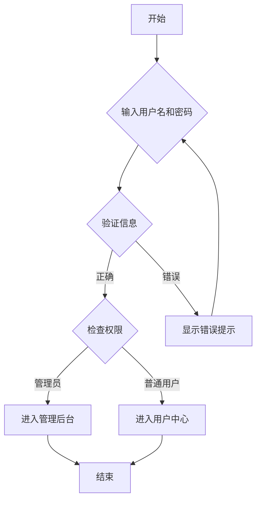
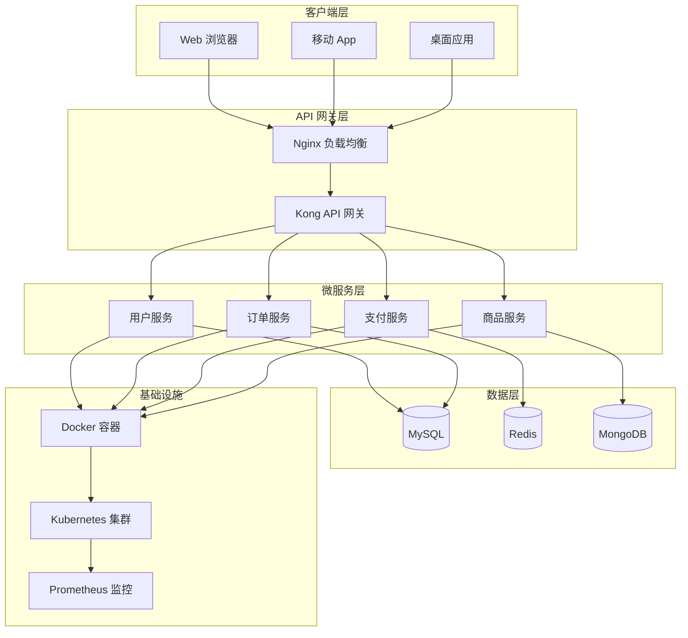
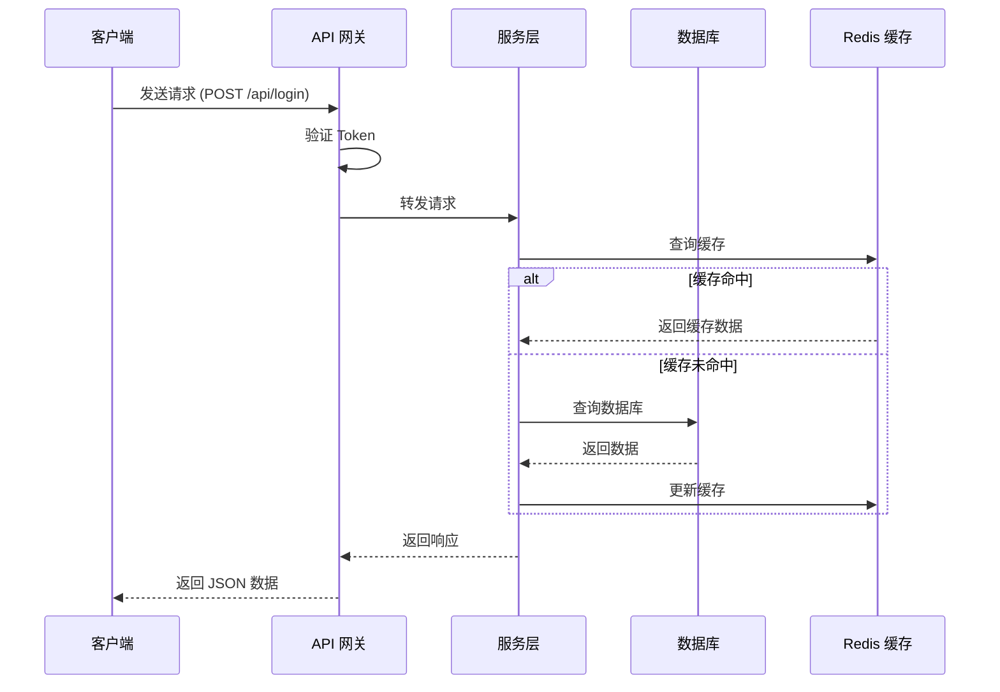
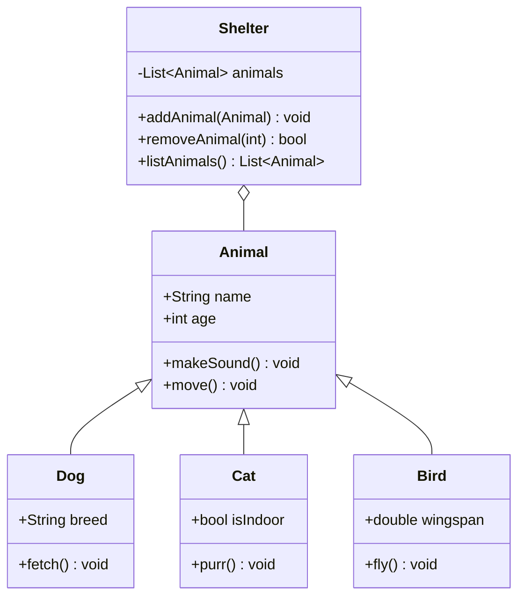
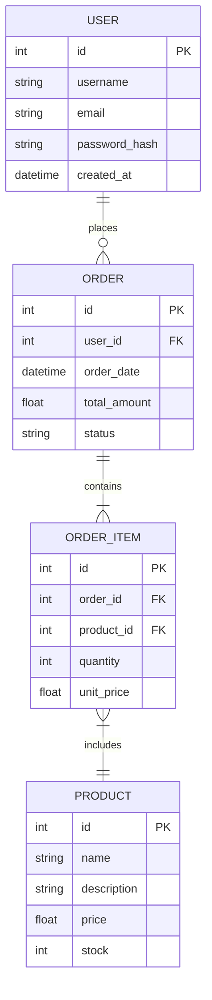
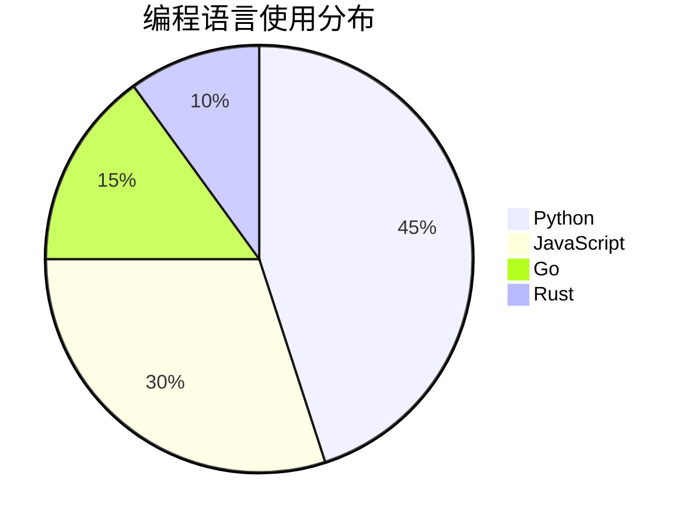
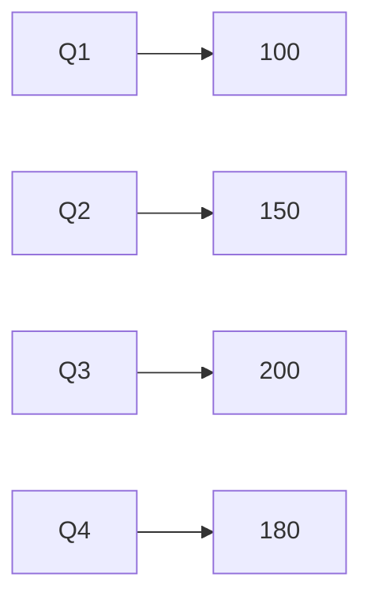

# 插图描述指南（Illustration Guide）

> 用于生成书籍中图表、流程图、架构图等插图的描述文档

---

## 插图信息

- **所属章节**：第 X 章 [章节标题]
- **插图编号**：图 X-X
- **插图类型**：流程图 / 架构图 / 时序图 / 类图 / ER 图 / 其他
- **用途说明**：[说明插图的作用和要表达的内容]

---

## 一、流程图（Flowchart）

### 图 X-1：[流程图标题]

**用途**：
[说明这个流程图要表达什么，例如：展示用户登录流程]

**Mermaid 代码**：

**文字描述**：
1. 用户开始登录操作
2. 输入用户名和密码
3. 系统验证用户信息
4. 如果信息错误，显示错误提示，返回步骤 2
5. 如果信息正确，检查用户权限
6. 根据权限进入不同界面：
   - 管理员：进入管理后台
   - 普通用户：进入用户中心
7. 登录流程结束

**插图位置**：
建议放置在 [章节] 的 [小节] 中，紧跟在 [某段文字] 之后。

**说明文字**：
> **图 X-1**：用户登录流程图。系统首先验证用户输入的信息，验证通过后根据用户权限引导至不同界面。

---

## 二、架构图（Architecture Diagram）

### 图 X-2：[架构图标题]

**用途**：
[说明这个架构图要表达什么，例如：展示微服务架构的整体设计]

**Mermaid 代码**：

**文字描述**：
系统采用分层架构设计，从上到下分为：
1. **客户端层**：包括 Web 浏览器、移动 App 和桌面应用
2. **API 网关层**：使用 Nginx 进行负载均衡，Kong 作为 API 网关
3. **微服务层**：包含用户服务、订单服务、支付服务、商品服务等独立微服务
4. **数据层**：使用 MySQL 存储关系型数据，Redis 作为缓存，MongoDB 存储文档数据
5. **基础设施层**：使用 Docker 容器化部署，Kubernetes 编排管理，Prometheus 监控

**技术栈**：
- 前端：React / Vue.js
- 后端：Python FastAPI / Go
- 数据库：MySQL 8.0, Redis 6.0, MongoDB 5.0
- 容器：Docker 20.10, Kubernetes 1.25
- 监控：Prometheus, Grafana

**插图位置**：
建议放置在 [章节] 的 [小节] 中，作为架构设计部分的开篇图。

**说明文字**：
> **图 X-2**：系统整体架构图。采用微服务架构，通过 API 网关统一入口，各服务独立部署，使用容器化技术提高可扩展性。

---

## 三、时序图（Sequence Diagram）

### 图 X-3：[时序图标题]

**用途**：
[说明这个时序图要表达什么，例如：展示 API 调用的时序]

**Mermaid 代码**：

**文字描述**：
1. 客户端发送登录请求到 API 网关
2. API 网关验证 Token 有效性
3. 验证通过后，转发请求到服务层
4. 服务层先查询 Redis 缓存
5. 如果缓存命中，直接返回缓存数据
6. 如果缓存未命中，查询数据库
7. 从数据库获取数据后，更新 Redis 缓存
8. 服务层将结果返回给 API 网关
9. API 网关将 JSON 数据返回给客户端

**关键点**：
- 使用缓存策略减少数据库查询
- Token 验证在网关层完成，减轻服务层压力
- 异步更新缓存，提高响应速度

**插图位置**：
建议放置在 [章节] 的 [小节] 中，配合 API 调用说明使用。

**说明文字**：
> **图 X-3**：API 调用时序图。展示客户端请求从网关到服务层再到数据库的完整流程，以及缓存策略的应用。

---

## 四、类图（Class Diagram）

### 图 X-4：[类图标题]

**用途**：
[说明这个类图要表达什么，例如：展示面向对象设计的类结构]

**Mermaid 代码**：

**文字描述**：
1. **Animal 基类**：
   - 属性：name（名字）、age（年龄）
   - 方法：makeSound（发出声音）、move（移动）

2. **Dog 子类**：继承 Animal
   - 属性：breed（品种）
   - 方法：fetch（捡回）

3. **Cat 子类**：继承 Animal
   - 属性：isIndoor（是否室内）
   - 方法：purr（呼噜声）

4. **Bird 子类**：继承 Animal
   - 属性：wingspan（翼展）
   - 方法：fly（飞行）

5. **Shelter 类**：
   - 属性：animals（动物列表）
   - 方法：addAnimal、removeAnimal、listAnimals
   - 与 Animal 是组合关系

**设计模式**：
- 使用继承实现代码复用
- 使用组合管理动物集合
- 符合开闭原则，易于扩展新动物类型

**插图位置**：
建议放置在 [章节] 的 [小节] 中，配合面向对象设计说明使用。

**说明文字**：
> **图 X-4**：类结构图。展示动物收容所系统的面向对象设计，使用继承和组合模式。

---

## 五、ER 图（Entity Relationship Diagram）

### 图 X-5：[ER 图标题]

**用途**：
[说明这个 ER 图要表达什么，例如：展示数据库表结构]

**Mermaid 代码**：

**文字描述**：
1. **USER 表**（用户表）：
   - 主键：id
   - 字段：username（用户名）、email（邮箱）、password_hash（密码哈希）、created_at（创建时间）
   - 与 ORDER 表是一对多关系

2. **ORDER 表**（订单表）：
   - 主键：id
   - 外键：user_id（关联 USER 表）
   - 字段：order_date（订单日期）、total_amount（总金额）、status（状态）
   - 与 ORDER_ITEM 表是一对多关系

3. **ORDER_ITEM 表**（订单项表）：
   - 主键：id
   - 外键：order_id（关联 ORDER 表）、product_id（关联 PRODUCT 表）
   - 字段：quantity（数量）、unit_price（单价）

4. **PRODUCT 表**（商品表）：
   - 主键：id
   - 字段：name（名称）、description（描述）、price（价格）、stock（库存）

**关系说明**：
- 一个用户可以有多个订单（1:N）
- 一个订单可以有多个订单项（1:N）
- 一个订单项对应一个商品（N:1）

**插图位置**：
建议放置在 [章节] 的 [小节] 中，配合数据库设计说明使用。

**说明文字**：
> **图 X-5**：数据库 ER 图。展示电商系统的核心表结构及其关系。

---

## 六、其他类型图表

### 图 X-6：[饼图/柱状图/折线图标题]

**用途**：
[说明这个图表要表达什么，例如：展示性能测试结果]

**Mermaid 代码（饼图）**：

**Mermaid 代码（柱状图）**：

**文字描述**：
[详细描述图表数据和分析结论]

**数据来源**：
[说明数据来源和统计方法]

**插图位置**：
建议放置在 [章节] 的 [小节] 中。

**说明文字**：
> **图 X-6**：[图表标题]。[简要说明]。

---

## 插图制作建议

### 工具推荐
1. **Mermaid**：适合流程图、时序图、类图等，Markdown 原生支持
2. **Draw.io**：适合复杂架构图、网络拓扑图
3. **Visio**：适合专业流程图、ER 图
4. **Excalidraw**：适合手绘风格图表
5. **PlantUML**：适合 UML 图

### 设计原则
1. **简洁明了**：避免过多细节，突出核心信息
2. **配色统一**：使用一致的配色方案
3. **标注清晰**：文字大小适中，易于阅读
4. **层次分明**：使用分组、颜色区分不同层次
5. **符合规范**：遵循行业标准符号

### 格式要求
1. **分辨率**：至少 300 DPI（印刷）或 150 DPI（屏幕）
2. **格式**：SVG（矢量）或 PNG（位图）
3. **尺寸**：宽度建议 800-1200 像素
4. **字体**：使用无衬线字体（如 Arial、Helvetica）

### 命名规范
- 格式：`图 X-X [简短描述].png`
- 示例：`图 3-1 用户登录流程.png`
- 存放位置：`book/images/chapter-X/`

---

## 插图检查清单

- [ ] 图表类型选择恰当
- [ ] 表达内容清晰准确
- [ ] 文字标注清晰可读
- [ ] 配色方案统一协调
- [ ] 层次结构分明
- [ ] 符合行业标准
- [ ] 分辨率满足要求
- [ ] 文件格式正确
- [ ] 命名规范统一
- [ ] 与正文内容配合良好

---

**文档版本**：1.0  
**创建日期**：[日期]  
**最后更新**：[日期]  
**插图总数**：[X] 张
