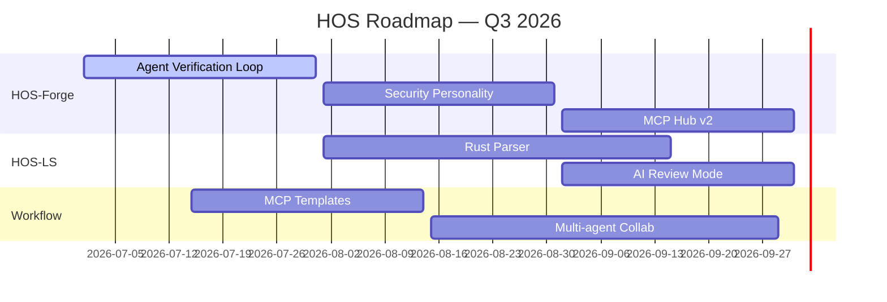

# hos-roadmap-gen

## Description
HOS 月度/季度 Roadmap 生成器。从当前项目状态、git 历史、未关闭 Issues、用户规划中提取信息，生成可视化 Roadmap，同步更新到 GitHub Projects、Discussions、README。

## Trigger
当用户提到以下关键词时激活：
- "roadmap"、"路线图"、"规划"
- "月度计划"、"季度规划"、"下个月"
- "更新 roadmap"、"发布计划"

## Context

### HOS 版本路线图（宏观）
```
HOS-Forge:
  v1.0 → AI Coding Agent（基础安全编码助手）
  v2.0 → Security Agent Framework（安全 Agent 编排）
  v3.0 → AI Security Engineer（全自动安全工程师）

HOS-LS:
  持续扩展语言支持 + 规则库 + 性能优化

HOS_SKILL_WORKFLOW:
  持续扩展 Workflow 模板 + MCP 集成 + Agent 协作
```

### 仓库路径
- HOS-Forge: `c:\1AAA-PROJECT\HOS\HOS-Forge`
- HOS-LS: `c:\1AAA-PROJECT\HOS\HOS-LS`
- HOS_SKILL_WORKFLOW: `c:\1AAA-PROJECT\WORKFLOW`

## Workflow

### Step 1: 收集当前状态
```powershell
# 各仓库最新 tag / version
git -C "<repo_path>" describe --tags --abbrev=0

# 未关闭的 issues（按标签分组）
gh issue list --repo <owner/repo> --state open --label "<label>"

# 最近 30 天 merged PRs（了解已完成的工作）
gh pr list --repo <owner/repo> --state merged --search "merged:>=<30_days_ago>"

# 当前 milestone（如果有）
gh api repos/<owner/repo>/milestones
```

### Step 2: 生成 Roadmap
使用以下格式：

#### Markdown 版（用于 README / Discussions）
```markdown
# HOS Roadmap — <month/year>

## Completed (<last_month>)
### HOS-Forge
- ✅ <completed_feature_1>
- ✅ <completed_feature_2>

### HOS-LS
- ✅ <completed_feature_1>

### HOS_SKILL_WORKFLOW
- ✅ <completed_feature_1>

## In Progress
### HOS-Forge
- 🔄 <in_progress_feature_1> — <brief_status>
- 🔄 <in_progress_feature_2> — <brief_status>

### HOS-LS
- 🔄 <in_progress_feature_1>

## Planned (<this_month>)
### HOS-Forge
- 📋 <planned_feature_1>
- 📋 <planned_feature_2>

### HOS-LS
- 📋 <planned_feature_1>
- 📋 <planned_feature_2>

### HOS_SKILL_WORKFLOW
- 📋 <planned_feature_1>

## Future (<next_quarter>)
- 🔮 <future_item_1>
- 🔮 <future_item_2>

---
*Last updated: <date>*
*Vote on features in our [Discussion](<link>)*
```

#### Mermaid 版（用于文档 / 博客）


#### 极简版（用于 README badge 区域）
```markdown
## Roadmap

| Month | HOS-Forge | HOS-LS | Workflow |
|-------|-----------|--------|----------|
| **Aug** | Security Personality | Rust Parser | MCP Templates |
| **Sep** | MCP Hub v2 | AI Review | Multi-agent |
| **Oct** | CLI Interface | C# Parser | Audit Pack |
```

### Step 3: 同步到各位置

| 位置 | 更新方式 | 格式 |
|------|---------|------|
| **GitHub Discussions** | 创建/更新 Roadmap Discussion | Markdown 完整版 |
| **各仓库 README** | 更新 Roadmap 部分 | 极简版（表格） |
| **GitHub Projects** | 创建/更新 Project board | 按仓库分 column |
| **官网/GitHub Pages** | 更新 roadmap 页面 | Mermaid + Markdown |
| **社交平台** | 发布 Roadmap 摘要 | 极简版 + 截图 |

### Step 4: 生成月度回顾
如果用户要求回顾上月，自动生成：

```markdown
# HOS Monthly Review — <month/year>

## By the Numbers
- **Commits**: <total> (Forge: <n>, LS: <n>, Workflow: <n>)
- **Issues Closed**: <total>
- **PRs Merged**: <total>
- **New Contributors**: <count>
- **Stars Gained**: <count>

## Key Achievements
1. <achievement_1>
2. <achievement_2>
3. <achievement_3>

## Missed Targets
- <missed_item>: <reason>

## Next Month Focus
1. <focus_1>
2. <focus_2>
```

## Rules
1. Roadmap 语言默认英文
2. 已完成的项必须保留（不删除，标记 ✅）
3. 每项必须关联至少一个 Issue（如果有的话）
4. Future 项目用 🔮 标记，表示尚未确认
5. 每月 1 号生成上月回顾 + 当月计划
6. Roadmap 变更必须在 Discussion 中通知
7. 输出保存到 `c:\1AAA-PROJECT\BOS\BOS-OPER\hos-skills\output\roadmap\` 目录
