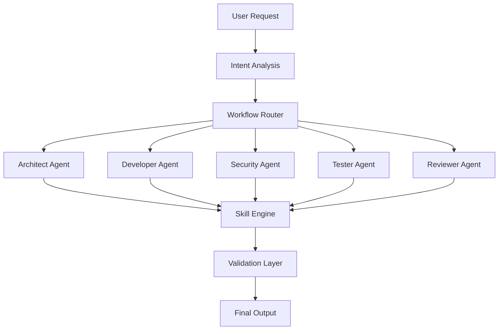
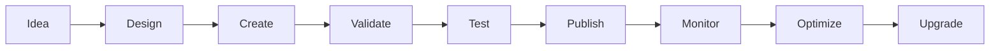
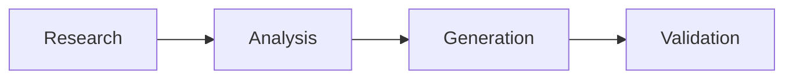
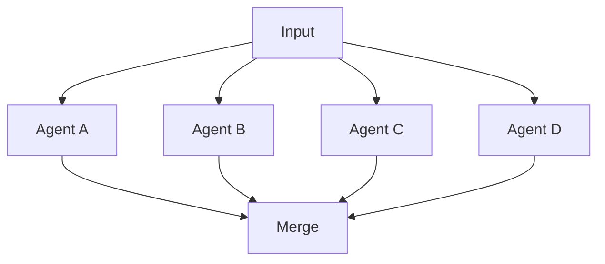
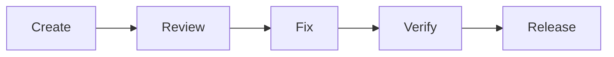
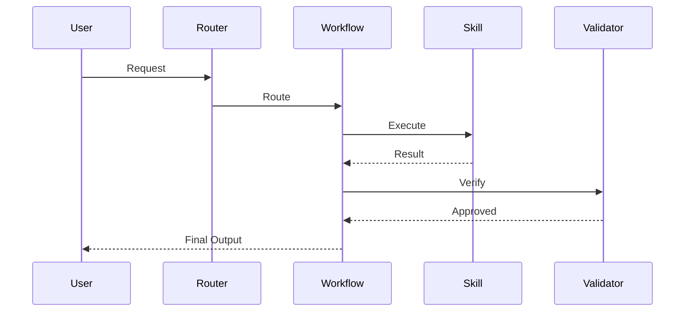
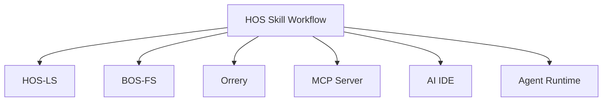

# HOS Skill Workflow

<p align="center">
  
</p>

<h1 align="center">
HOS Skill Workflow
</h1>

<p align="center">
Enterprise AI Skill Engineering Framework
</p>

<p align="center">


</p>

<p align="center">

[📖 Documentation](./docs)
•
[🚀 Quick Start](#quick-start)
•
[🧩 Skills](./skills)
•
[🔄 Workflows](./workflows)
•
[🛣 Roadmap](#roadmap)

</p>

---

## Overview

HOS Skill Workflow 是一个面向 AI Agent、AI IDE、Claude Code、Codex、Cursor、Gemini CLI 的 Skill 工程化框架。

核心目标：

✅ Skill 标准化

✅ Workflow 工程化

✅ Multi-Agent 编排

✅ Context 压缩

✅ Token 优化

✅ 企业级复用

---

## Architecture



---

## Skill Lifecycle



---

## Workflow Types

### Sequential Workflow



### Parallel Workflow



### Review Workflow



---

## Repository Structure

```text
HOS_SKILL_WORKFLOW

├── skills/
├── workflows/
├── templates/
├── standards/
├── docs/
├── examples/
├── assets/
└── README.md
```

---

## Core Components

| Module      | Description |
| ----------- | ----------- |
| Skills      | 可复用能力单元     |
| Workflows   | 工作流定义       |
| Templates   | Skill 模板    |
| Standards   | 开发规范        |
| Registry    | Skill 索引    |
| Validation  | 质量验证        |
| Marketplace | Skill 分发    |

---

## Skill Execution Model



---

## Compatibility Matrix

| Platform      | Support |
| ------------- | ------- |
| Claude Code   | ✅       |
| OpenAI Codex  | ✅       |
| Cursor        | ✅       |
| Gemini CLI    | ✅       |
| VSCode AI IDE | ✅       |
| Continue.dev  | ✅       |
| Cline         | ✅       |
| Roo Code      | ✅       |
| OpenHands     | 🚧      |

---

## Example Ecosystem



---

## Quick Start

### Clone

```bash
git clone https://github.com/lxcxjxhx/HOS_SKILL_WORKFLOW.git
```

### Skill Development

```bash
skills/
└── my_skill
    ├── SKILL.md
    ├── metadata.yaml
    ├── examples.md
    └── changelog.md
```

### Run Workflow

```bash
workflow run code-review
```

---

## Roadmap

### v1

* Skill Standard
* Workflow Standard
* Validation Framework

### v2

* Skill Registry
* Skill Marketplace
* Workflow Builder

### v3

* Auto Skill Generation
* Auto Workflow Generation
* Multi-Agent Runtime

### v4

* Autonomous Evolution
* Enterprise Platform
* Skill Cloud

---

## Contributing

Pull Requests are welcome.

Please read:

* CONTRIBUTING.md
* CODE_OF_CONDUCT.md

before submitting changes.

---


## License

MIT License

---

<p align="center">

Building the Future of Skill Engineering

</p>

