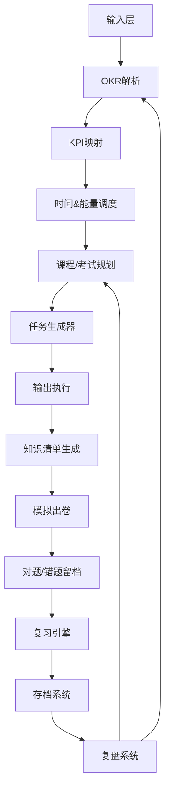

# 🧠 生活OKR学习系统 (LifeOKR Learning System)

> 一个把「模糊学习行为」转化为「可验证资产输出」的自动化调度系统。

---

## 📋 系统概述

生活OKR学习系统是一个基于OKR方法论的自动化学习调度引擎，将个人学习行为从「靠意志力的碎片化学习」升级为「由OKR驱动 + KPI约束 + 时间切片 + 自动任务生成 + 输出强制化的闭环系统」。

### 核心特性

- **OKR驱动** — 基于OKR方法论管理个人成长
- **KPI约束** — 量化学习目标和进度
- **时间切片** — 智能时间分配和能量匹配
- **自动任务生成** — 一键生成今日学习任务
- **输出强制化** — 每个任务必须有可验证输出物
- **间隔重复** — 最大化复习效率
- **模拟考核验** — 自动出卷核验学习效果
- **知识清单** — 自动生成结构化知识资产
- **存档系统** — 支持SAVE/LOAD，随时恢复进度

---

## 🚀 快速开始

### 1. 克隆到本地

```bash
git clone https://github.com/lxcxjxhx/HOS_SKILL_WORKFLOW.git
cd HOS_SKILL_WORKFLOW/S-02-HOS-LIFE-OKR
```

### 2. 加载技能

在 Claude Code / Cursor / Windsurf 等 AI IDE 中加载 `SKILL.md` 文件。

### 3. 开始使用

```
用户: "我要系统学习信息安全"
→ 收集 OKR + KR + KPI + 当前进度 → 生成今日计划

用户: "今天有2小时，能量7"
→ 生成 warmup复习(10min) + 核心任务(90min) + 输出(30min) + cooldown复习(10min) + 复盘(10min)

用户: "📖学完第7章"
→ 一键5步: 出卷→留档→知识清单→队列→资产摘要

用户: "✅交卷" + [答案]
→ 一键6步: 评分→留档→考后总结→队列→快照→报告
```

---

## ⚡ 快捷命令

| 命令 | 自动完成步骤 |
|------|-------------|
| `📋今日启动` | 加载存档 → 检查复习队列 → 生成计划 → 仪表盘 |
| `📖学完第X章` | 出卷 → 评分留档 → 知识清单 → 复习队列 → 资产摘要 |
| `✅交卷` | 评分 → 留档 → 考后总结 → 队列 → 快照 → 报告 |
| `🧠开始复习` | 检查队列 → 按优先级出题 → 逐题更新间隔 |
| `💾SAVE` | 快照编码输出 |
| `📊周复盘` | 汇总 → 趋势 → 资产报告 → 调整 → 快照 |
| `📚资产总览` | 档案统计 → 清单索引 → 产出索引 → 雷达 |
| `📁整理文件` | 规范命名 → 更新索引 → 目录树 |
| `🔄批量错题` | 调取错题本 → 专项卷 → 反馈 → 留档 → 报告 |
| `🔍查关键词` | 跨知识清单/错题/产出搜索 |

---

## 📐 核心算法

### KR 优先级
```
KR优先级 = KR权重 × (1 - KR完成率) × 紧急度
紧急度 = min(当前日到截止日的天数 / 总天数, 1.0)
```

### 任务生成 5 步法
```
1. 选 KR（优先级最高）
2. 匹配能量等级 → 任务类型
3. 填充 KPI 缺口任务
4. 插入复盘任务 + 复习块
5. 限制总时长 ≤ available_minutes
```

### 间隔重复
```
初始: 1天 → 正确→间隔×2 → 错误→间隔÷2(重入短期)
最大间隔: 90天(月度抽查)
```

### 考试四阶段拆分
```
40% 教材学习 → 25% 实践实验 → 20% 刷题模拟 → 15% 总复习冲刺
```

---

## 📁 文件目录规范

```
knowledge/ch{N}-*.md               # 知识清单
exam-papers/{quiz|phase|mock|special}/*.md  # 试卷库
exam-review/YYYY-MM-DD-*.md        # 考后总结
review/review-notes/YYYY-MM-DD-*.md # 复习速记
error-analysis/*-error-analysis.md  # 错题专题分析
weekly/W{周}-{年}.md               # 周报
outputs/{code|reports|notes|blogs}/* # 学习产出物
snapshots/SNAP-*.json              # 存档快照
```

---

## 🧩 模块索引

| # | 模块 | 文件 | 主要用途 |
|---|------|------|---------|
| 01 | 输入层 | `01-input-context.md` | 查看完整输入Schema |
| 02 | OKR解析 | `02-okr-parser.md` | KR优先级计算细节 |
| 03 | KPI映射 | `03-kpi-mapper.md` | 7种KPI类型定义 |
| 04 | 时间调度 | `04-scheduler.md` | 能量映射完整规则 |
| 05 | 课程规划 | `05-course-plan.md` | 四阶段计划详情 |
| 06 | 任务生成 | `06-task-generator.md` | TaskScore计算示例 |
| 07 | 输出执行 | `07-execution.md` | 全部输出类型绑定 |
| 08 | 模拟考 | `08-mock-exam.md` | 出卷算法+核验反馈 |
| 09 | 留档系统 | `09-answer-archive.md` | 留档结构+掌握度趋势 |
| 10 | 复习引擎 | `10-review-engine.md` | 完整间隔重复算法 |
| 11 | SAVE/LOAD | `11-save-load.md` | 快照结构+存档协议 |
| 12 | 知识清单 | `12-knowledge-list.md` | 自动触发场景 |
| 13 | 文件管理 | `13-file-mgmt.md` | 完整目录树+命名规范 |
| 14 | 快捷命令 | `14-batch-cmds.md` | 一键流程详细说明 |
| 15 | 复盘系统 | `15-review-system.md` | 复盘模板+调整规则 |
| 16 | API | `16-api.md` | 全部函数定义 |
| 17 | 对话流程 | `17-dialog.md` | 完整对话流示例 |
| 18 | 系统Prompt | `18-system-prompt.md` | Prompt完整版 |
| 19 | 状态矩阵 | `19-state-matrix.md` | 全部边界处理 |
| 20 | 快速参考 | `20-quickref.md` | 用户引导示例 |

---

## 📊 调整规则

| 周执行率 | 系统动作 | 具体调整 |
|----------|---------|---------|
| < 60% | 🔻 降低复杂度 | 减少KR数量、降低KPI目标、简化任务 |
| 60%-85% | ➡️ 保持 | 微调任务分配 |
| > 85% | 🔺 提升难度 | 增加KR权重、提高KPI目标、扩展深度 |

| 模拟考准确率 | 系统动作 |
|-------------|---------|
| ≥ 90% | 🟢 加速前进，减少任务量 |
| 75%-89% | 🟡 保持，穿插错题复习 |
| 60%-74% | 🟠 加强，增加专题学习 |
| < 60% | 🔴 暂停新课，全量复习重测 |

---

## ⏱ 时间切片与能量映射

| 能量 | 任务类型 | 输出类型 |
|------|---------|---------|
| 8-10 | 编码、实验 | GitHub commit + 报告 |
| 5-7 | 看课、阅读 | 结构化笔记 |
| 3-4 | 整理、复盘 | 复盘文档 |
| 任何 | 间隔复习(5-15min微块) | 复习记录 |

时间切片: `恢复期 → warmup复习(间隔重复) → 核心学习块 → 输出块 → cooldown复习 → 复盘块`

---

## 🏁 状态矩阵（场景→响应速查）

| 场景 | 行为 |
|------|------|
| 用户提供OKR但缺数据 | 追问完成进度+时间+考试目标 |
| 用户说SAVE | 生成快照+编码输出 |
| 用户说LOAD | 提示粘贴存档+解码恢复 |
| 用户说复习 | 检查队列+按优先级出题 |
| 模拟考未通过 | 暂停新课+强化薄弱+重测 |
| 连续执行率<60% | 建议减少KR/降低目标 |
| 留档数据>1000条 | 按月分段索引 |
| 复习队列空 | 进入月度抽查模式 |
| 复习>50超期 | 分3天消化 |

---

## 💬 对话启动示例

```
用户: "我要系统学习信息安全"
→ 收集 OKR + KR + KPI + 当前进度 → 生成今日计划

用户: "今天有2小时，能量7"
→ 生成 warmup复习(10min) + 核心任务(90min) + 输出(30min) + cooldown复习(10min) + 复盘(10min)

用户: "📖学完第7章"
→ 一键5步: 出卷→留档→知识清单→队列→资产摘要

用户: "✅交卷" + [答案]
→ 一键6步: 评分→留档→考后总结→队列→快照→报告

用户: "任务1完成了，commit在这里"
→ 记录→归档→知识清单→复盘→快照

用户: "💾SAVE"
→ 生成可复制存档编码

用户: "LOAD"
→ 粘贴编码→解码恢复→生成计划
```

---

## 📐 系统架构



---

## 📚 详细文档

- [`SKILL.md`](./SKILL.md) — 完整技能定义和系统Prompt
- [`01-input-context.md`](./01-input-context.md) — 输入层详细Schema
- [`02-okr-parser.md`](./02-okr-parser.md) — OKR解析模块
- [`03-kpi-mapper.md`](./03-kpi-mapper.md) — KPI映射模块
- [`04-scheduler.md`](./04-scheduler.md) — 时间调度模块
- [`05-course-plan.md`](./05-course-plan.md) — 课程规划模块
- [`06-task-generator.md`](./06-task-generator.md) — 任务生成器
- [`07-execution.md`](./07-execution.md) — 输出执行模块
- [`08-mock-exam.md`](./08-mock-exam.md) — 模拟考模块
- [`09-answer-archive.md`](./09-answer-archive.md) — 留档系统
- [`10-review-engine.md`](./10-review-engine.md) — 复习引擎
- [`11-save-load.md`](./11-save-load.md) — 存档系统
- [`12-knowledge-list.md`](./12-knowledge-list.md) — 知识清单
- [`13-file-mgmt.md`](./13-file-mgmt.md) — 文件管理
- [`14-batch-cmds.md`](./14-batch-cmds.md) — 快捷命令
- [`15-review-system.md`](./15-review-system.md) — 复盘系统
- [`16-api.md`](./16-api.md) — API定义
- [`17-dialog.md`](./17-dialog.md) — 对话流程
- [`18-system-prompt.md`](./18-system-prompt.md) — 系统Prompt
- [`19-state-matrix.md`](./19-state-matrix.md) — 状态矩阵
- [`20-quickref.md`](./20-quickref.md) — 快速参考

---

## 📄 许可证

MIT License

---

> *「把模糊的学习行为，转化为可验证的资产输出」*
